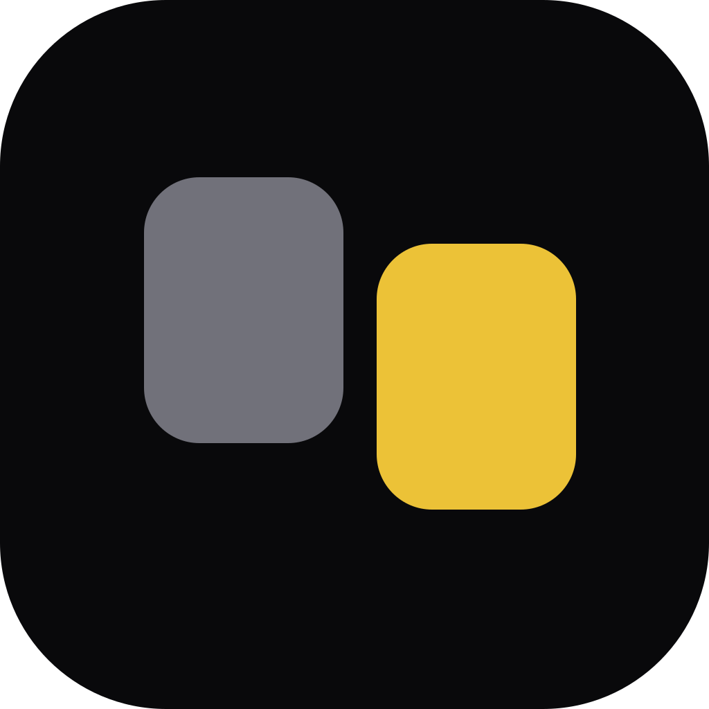

# Promptly

<picture>
  <source media="(prefers-color-scheme: dark)" srcset="src/renderer/assets/brand/logo-on-dark.svg">
  
</picture>

Capture, organize, and reuse text snippets with a shortcut. A local-first Windows app.

Keep useful prompts, replies, notes, and code in one searchable library. Select text in a
supported application, capture it, and copy the complete snippet whenever you need it.

## Features

- **Capture selected text:** save a selection through native Windows UI Automation,
  with confirmation and first-launch practice capture.
- **Manage your library:** capture, edit, duplicate, delete, and reuse snippets.
- **Find what you need:** full-text search, tag filters, sorting, and paged browsing.
- **Organize with tags:** assign tags, rename them, and customize their colors.
- **Choose your workspace:** Compact and Regular views, light and dark themes,
  saved window geometry, and pinning.
- **Keep commands close:** customizable keyboard shortcuts and a tray menu with
  recent snippets, capture pause, and quick access to the library.
- **Keep your data local:** SQLite storage, JSON backup and restore, and Markdown export.
  The app works offline with bundled assets; no telemetry or cloud sync is configured.
- **Update on your terms:** installed builds check at startup and in Settings. An
  available update is suggested; downloading, applying and restarting require your choice.

## Getting started

Read the [Getting Started guide](https://github.com/zeyadomran/promptly/wiki/Getting-Started)
and explore the [Promptly wiki](https://github.com/zeyadomran/promptly/wiki) for
[capture](https://github.com/zeyadomran/promptly/wiki/Capturing-Text),
[library and search](https://github.com/zeyadomran/promptly/wiki/Library-and-Search),
[keyboard shortcuts](https://github.com/zeyadomran/promptly/wiki/Keyboard-Shortcuts), and
[backup and restore](https://github.com/zeyadomran/promptly/wiki/Backup-and-Restore).

Promptly currently targets **Windows x64**. [Release automation](RELEASING.md) supports
signed installers and optional updates; a production release is not yet qualified. Windows 11 is the primary
development environment; Windows 10 compatibility still needs manual qualification.
macOS, Linux, x86, and ARM64 are unsupported.

Capture depends on the source application's accessibility provider. Unsupported,
empty, protected, or failed selections save nothing. Native capture never simulates
Ctrl+C or reads or writes the clipboard; clipboard capture fallback is deferred.
Explicit Copy actions write the clipboard. See
[Troubleshooting](https://github.com/zeyadomran/promptly/wiki/Troubleshooting) for limitations.

## Contributing and reporting issues

Read the [Privacy Policy](PRIVACY.md) for local storage, capture, updates, and information you choose to share. It is also available from General Settings in the app.

See [CONTRIBUTORS.md](CONTRIBUTORS.md) for contributions and ordinary bug reports,
[DEVELOPMENT.md](DEVELOPMENT.md) for running and building the app, and
[SECURITY.md](SECURITY.md) for private vulnerability reports.

## License

Promptly's first-party code and supplied brand assets are licensed under the
[MIT License](LICENSE), copyright 2026 Zeyad Omran. Third-party components retain
their own terms; see [license provenance and release qualification](packaging/README.md).
